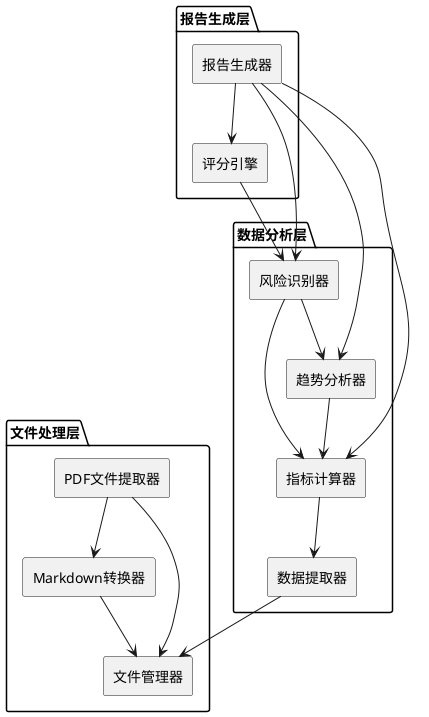

# **1. 实现模型**

## **1.1 上下文视图**

系统采用模块化的单体架构，各功能模块通过清晰的接口进行交互。整体架构分为三层：

1. **文件处理层**：负责PDF文件的提取、转换和存储
2. **数据分析层**：负责财务数据提取、指标计算和风险识别
3. **报告生成层**：负责分析报告的生成和输出



## **1.2 服务/组件总体架构**

### **核心组件设计**

#### **1. PDF文件提取器（PDFExtractor）**
- **职责**：扫描源文件夹，识别并提取PDF格式的财报文件
- **输入**：源文件夹路径
- **输出**：PDF文件列表
- **依赖**：文件系统API

#### **2. Markdown转换器（MDConverter）**
- **职责**：将PDF文件转换为结构化的Markdown格式
- **输入**：PDF文件内容
- **输出**：Markdown文本
- **依赖**：Pandoc（文档转换工具，版本3.9+）

#### **3. 文件管理器（FileManager）**
- **职责**：管理文件的读写、存储和版本控制
- **输入**：文件路径、文件内容
- **输出**：文件操作结果
- **依赖**：文件系统API

#### **4. 数据提取器（DataExtractor）**
- **职责**：从Markdown文件中提取三大财务报表的结构化数据
- **输入**：Markdown文本
- **输出**：结构化的财务数据对象
- **依赖**：正则表达式、文本解析算法

#### **5. 指标计算器（IndicatorCalculator）**
- **职责**：计算各类财务指标（盈利、偿债、运营、成长、现金流）
- **输入**：结构化的财务数据
- **输出**：财务指标集合
- **依赖**：数学计算库

#### **6. 趋势分析器（TrendAnalyzer）**
- **职责**：分析财务指标的趋势、进行行业和同行对比
- **输入**：多年财务指标、行业基准数据
- **输出**：趋势分析结论
- **依赖**：统计分析库

#### **7. 风险识别器（RiskDetector）**
- **职责**：识别财务风险、经营风险和潜在问题
- **输入**：财务指标、趋势分析结果
- **输出**：风险清单
- **依赖**：风险规则引擎

#### **8. 报告生成器（ReportGenerator）**
- **职责**：生成结构化的Markdown分析报告
- **输入**：财务指标、趋势分析、风险清单
- **输出**：Markdown格式的分析报告
- **依赖**：模板引擎

#### **9. 评分引擎（ScoringEngine）**
- **职责**：对财报质量进行综合评分
- **输入**：风险清单、财务指标
- **输出**：综合评分（1-10分）
- **依赖**：评分算法

## **1.3 实现设计文档**

### **技术栈选择**

#### **编程语言**
- **Python 3.9+**：适合数据处理和分析，拥有丰富的财务分析库

#### **核心依赖库**
1. **文档转换**
   - `pandoc`：通用文档转换工具，支持PDF转Markdown（版本3.9+）
   - `pypandoc`：Python的pandoc封装库

2. **数据处理**
   - `pandas`：结构化数据处理和分析
   - `numpy`：数值计算

3. **文本处理**
   - `re`：正则表达式，用于数据提取
   - `markdown`：Markdown文件生成

4. **可视化**
   - `matplotlib`：图表生成
   - `plotly`：交互式图表

5. **配置管理**
   - `pyyaml`：YAML配置文件解析
   - `python-dotenv`：环境变量管理

6. **日志和监控**
   - `logging`：日志记录
   - `tqdm`：进度条显示

### **目录结构设计**

```
Financial_Reports/
├── src/                          # 源代码目录
│   ├── core/                     # 核心功能模块
│   │   ├── pdf_extractor.py      # PDF文件提取
│   │   ├── md_converter.py       # Markdown转换
│   │   ├── data_extractor.py     # 数据提取
│   │   ├── indicator_calculator.py # 指标计算
│   │   ├── trend_analyzer.py     # 趋势分析
│   │   ├── risk_detector.py      # 风险识别
│   │   └── report_generator.py   # 报告生成
│   ├── utils/                    # 工具模块
│   │   ├── file_manager.py       # 文件管理
│   │   ├── config_loader.py      # 配置加载
│   │   ├── logger.py             # 日志工具
│   │   └── validator.py          # 数据验证
│   ├── models/                   # 数据模型
│   │   ├── financial_data.py     # 财务数据模型
│   │   ├── indicators.py         # 指标模型
│   │   └── report.py             # 报告模型
│   └── main.py                   # 主程序入口
├── config/                       # 配置文件目录
│   ├── config.yaml               # 主配置文件
│   ├── risk_thresholds.yaml      # 风险阈值配置
│   └── industry_benchmarks.yaml  # 行业基准数据
├── source/                       # 源文件夹（用户放置PDF文件）
├── repository/                   # 仓库文件夹（存储Markdown文件）
├── reports/                      # 分析报告输出目录
├── logs/                         # 日志文件目录
├── tests/                        # 测试代码目录
│   ├── test_pdf_extractor.py
│   ├── test_data_extractor.py
│   └── test_indicator_calculator.py
├── requirements.txt              # 依赖包列表
└── README.md                     # 项目说明文档
```

### **核心算法设计**

#### **1. PDF转Markdown算法（使用Pandoc）**
```
输入：PDF文件路径
输出：Markdown文本

步骤：
1. 检查pandoc是否可用
2. 使用pandoc命令转换PDF为Markdown：
   pandoc input.pdf -f pdf -t markdown -o output.md
3. 可选参数：
   --extract-media：提取图片到指定目录
   --wrap=none：不自动换行
   --markdown-headings=atx：使用ATX风格标题
4. 读取生成的Markdown文件
5. 清理和格式化Markdown内容
6. 返回Markdown文本
```

#### **2. 财务数据提取算法**
```
输入：Markdown文本
输出：财务数据对象

步骤：
1. 识别资产负债表区域（通过关键词"资产负债表"）
2. 提取资产负债表数据（资产、负债、所有者权益）
3. 识别利润表区域（通过关键词"利润表"）
4. 提取利润表数据（收入、成本、费用、利润）
5. 识别现金流量表区域（通过关键词"现金流量表"）
6. 提取现金流量表数据（经营、投资、筹资现金流）
7. 数据清洗和验证
8. 返回财务数据对象
```

#### **3. 财务指标计算算法**
```
输入：财务数据对象
输出：财务指标集合

步骤：
1. 计算盈利能力指标：
   - 毛利率 = (营业收入 - 营业成本) / 营业收入
   - 净利率 = 净利润 / 营业收入
   - ROE = 净利润 / 平均净资产
   - ROA = 净利润 / 平均总资产

2. 计算偿债能力指标：
   - 资产负债率 = 负债总额 / 资产总额
   - 流动比率 = 流动资产 / 流动负债
   - 速动比率 = (流动资产 - 存货) / 流动负债

3. 计算运营能力指标：
   - 存货周转率 = 营业成本 / 平均存货
   - 应收账款周转率 = 营业收入 / 平均应收账款
   - 总资产周转率 = 营业收入 / 平均总资产

4. 计算成长能力指标：
   - 营收增长率 = (本期营收 - 上期营收) / 上期营收
   - 净利润增长率 = (本期净利润 - 上期净利润) / 上期净利润

5. 计算现金流指标：
   - 自由现金流 = 经营现金流 - 资本性支出

6. 返回指标集合
```

#### **4. 风险识别算法**
```
输入：财务指标、趋势分析结果
输出：风险清单

步骤：
1. 加载风险阈值配置
2. 扫描财务风险信号：
   - 资产负债率 > 阈值 → 高负债风险
   - 流动比率 < 阈值 → 短期偿债风险
   - 经营现金流 < 0 → 现金流风险

3. 扫描经营风险信号：
   - 营收增长率 < 0 → 营收下滑风险
   - 净利润增长率 < 0 → 盈利下滑风险
   - 毛利率下降趋势 → 竞争力下降风险

4. 检查潜在问题：
   - 指标接近风险阈值 → 预警
   - 数据异常波动 → 异常预警

5. 划分风险等级（高、中、低）
6. 返回风险清单
```

#### **5. 综合评分算法**
```
输入：风险清单、财务指标
输出：综合评分（1-10分）

步骤：
1. 初始分数 = 10
2. 根据风险等级扣分：
   - 高风险：扣3分
   - 中风险：扣2分
   - 低风险：扣1分

3. 根据指标表现调整：
   - 指标优于行业平均：加0.5分
   - 指标劣于行业平均：扣0.5分

4. 确保分数在1-10范围内
5. 返回综合评分
```

# **2. 接口设计**

## **2.1 总体设计**

系统采用函数式接口设计，各模块通过Python函数进行交互。主程序通过配置文件控制执行流程。

## **2.2 接口清单**

### **文件处理接口**

#### **extract_pdf_files(source_folder: str) -> List[str]**
- **功能**：从源文件夹提取所有PDF文件
- **参数**：
  - `source_folder`：源文件夹路径
- **返回**：PDF文件路径列表
- **异常**：`FolderNotFoundError`、`PermissionError`

#### **convert_pdf_to_markdown(pdf_path: str, output_folder: str) -> str**
- **功能**：将PDF文件转换为Markdown格式
- **参数**：
  - `pdf_path`：PDF文件路径
  - `output_folder`：输出文件夹路径
- **返回**：Markdown文件路径
- **异常**：`PDFParseError`、`FileWriteError`

### **数据提取接口**

#### **extract_financial_data(markdown_path: str) -> FinancialData**
- **功能**：从Markdown文件提取财务数据
- **参数**：
  - `markdown_path`：Markdown文件路径
- **返回**：财务数据对象
- **异常**：`DataExtractionError`、`DataValidationError`

### **指标计算接口**

#### **calculate_indicators(financial_data: FinancialData) -> Indicators**
- **功能**：计算所有财务指标
- **参数**：
  - `financial_data`：财务数据对象
- **返回**：财务指标对象
- **异常**：`CalculationError`

#### **calculate_profitability_indicators(financial_data: FinancialData) -> Dict**
- **功能**：计算盈利能力指标
- **参数**：
  - `financial_data`：财务数据对象
- **返回**：盈利能力指标字典

#### **calculate_solvency_indicators(financial_data: FinancialData) -> Dict**
- **功能**：计算偿债能力指标
- **参数**：
  - `financial_data`：财务数据对象
- **返回**：偿债能力指标字典

#### **calculate_operation_indicators(financial_data: FinancialData) -> Dict**
- **功能**：计算运营能力指标
- **参数**：
  - `financial_data`：财务数据对象
- **返回**：运营能力指标字典

#### **calculate_growth_indicators(financial_data: FinancialData, historical_data: List[FinancialData]) -> Dict**
- **功能**：计算成长能力指标
- **参数**：
  - `financial_data`：当期财务数据
  - `historical_data`：历史财务数据列表
- **返回**：成长能力指标字典

#### **calculate_cashflow_indicators(financial_data: FinancialData) -> Dict**
- **功能**：计算现金流指标
- **参数**：
  - `financial_data`：财务数据对象
- **返回**：现金流指标字典

### **趋势分析接口**

#### **analyze_trend(indicators_list: List[Indicators]) -> TrendAnalysis**
- **功能**：分析财务指标趋势
- **参数**：
  - `indicators_list`：多年财务指标列表
- **返回**：趋势分析结果
- **异常**：`InsufficientDataError`

#### **compare_with_industry(indicators: Indicators, industry_benchmarks: Dict) -> ComparisonResult**
- **功能**：与行业基准对比
- **参数**：
  - `indicators`：财务指标
  - `industry_benchmarks`：行业基准数据
- **返回**：对比结果

#### **compare_with_peers(indicators: Indicators, peer_indicators: List[Indicators]) -> ComparisonResult**
- **功能**：与同行公司对比
- **参数**：
  - `indicators`：本公司财务指标
  - `peer_indicators`：同行公司财务指标列表
- **返回**：对比结果

### **风险识别接口**

#### **detect_risks(indicators: Indicators, trend_analysis: TrendAnalysis) -> RiskList**
- **功能**：识别所有风险
- **参数**：
  - `indicators`：财务指标
  - `trend_analysis`：趋势分析结果
- **返回**：风险清单

#### **detect_financial_risks(indicators: Indicators) -> List[Risk]**
- **功能**：识别财务风险
- **参数**：
  - `indicators`：财务指标
- **返回**：财务风险列表

#### **detect_operation_risks(indicators: Indicators, trend_analysis: TrendAnalysis) -> List[Risk]**
- **功能**：识别经营风险
- **参数**：
  - `indicators`：财务指标
  - `trend_analysis`：趋势分析结果
- **返回**：经营风险列表

#### **classify_risk_level(risk: Risk) -> str**
- **功能**：划分风险等级
- **参数**：
  - `risk`：风险对象
- **返回**：风险等级（"高"、"中"、"低"）

### **报告生成接口**

#### **generate_report(indicators: Indicators, trend_analysis: TrendAnalysis, risks: RiskList) -> str**
- **功能**：生成分析报告
- **参数**：
  - `indicators`：财务指标
  - `trend_analysis`：趋势分析结果
  - `risks`：风险清单
- **返回**：Markdown格式的报告内容
- **异常**：`ReportGenerationError`

#### **calculate_score(risks: RiskList, indicators: Indicators) -> int**
- **功能**：计算综合评分
- **参数**：
  - `risks`：风险清单
  - `indicators`：财务指标
- **返回**：综合评分（1-10分）

#### **save_report(report_content: str, output_path: str) -> str**
- **功能**：保存报告到文件
- **参数**：
  - `report_content`：报告内容
  - `output_path`：输出文件路径
- **返回**：报告文件路径
- **异常**：`FileWriteError`

### **主程序接口**

#### **main(config_path: str) -> None**
- **功能**：主程序入口
- **参数**：
  - `config_path`：配置文件路径
- **流程**：
  1. 加载配置
  2. 提取PDF文件
  3. 转换为Markdown
  4. 提取财务数据
  5. 计算财务指标
  6. 分析趋势
  7. 识别风险
  8. 生成报告
  9. 保存报告

# **4. 数据模型**

## **4.1 设计目标**

数据模型设计遵循以下原则：
1. **清晰性**：每个模型有明确的职责和边界
2. **可扩展性**：支持未来新增财务指标和分析维度
3. **类型安全**：使用Python类型注解确保类型安全
4. **验证性**：内置数据验证逻辑

## **4.2 模型实现**

### **FinancialData（财务数据模型）**

```python
from dataclasses import dataclass
from typing import Dict, Optional
from datetime import datetime

@dataclass
class BalanceSheet:
    """资产负债表数据"""
    # 资产
    total_assets: float  # 资产总计
    current_assets: float  # 流动资产
    non_current_assets: float  # 非流动资产
    cash: float  # 货币资金
    accounts_receivable: float  # 应收账款
    inventory: float  # 存货
    
    # 负债
    total_liabilities: float  # 负债总计
    current_liabilities: float  # 流动负债
    non_current_liabilities: float  # 非流动负债
    
    # 所有者权益
    total_equity: float  # 所有者权益总计
    
    # 元数据
    report_date: datetime  # 报告日期

@dataclass
class IncomeStatement:
    """利润表数据"""
    operating_revenue: float  # 营业收入
    operating_cost: float  # 营业成本
    gross_profit: float  # 毛利
    operating_profit: float  # 营业利润
    total_profit: float  # 利润总额
    net_profit: float  # 净利润
    
    # 费用
    selling_expense: float  # 销售费用
    admin_expense: float  # 管理费用
    financial_expense: float  # 财务费用
    
    # 元数据
    report_date: datetime  # 报告日期

@dataclass
class CashFlowStatement:
    """现金流量表数据"""
    # 经营活动现金流
    operating_cash_inflow: float  # 经营现金流入
    operating_cash_outflow: float  # 经营现金流出
    net_operating_cash: float  # 经营现金净流量
    
    # 投资活动现金流
    investing_cash_inflow: float  # 投资现金流入
    investing_cash_outflow: float  # 投资现金流出
    net_investing_cash: float  # 投资现金净流量
    
    # 筹资活动现金流
    financing_cash_inflow: float  # 筹资现金流入
    financing_cash_outflow: float  # 筹资现金流出
    net_financing_cash: float  # 筹资现金净流量
    
    # 现金净增加额
    net_cash_increase: float  # 现金净增加额
    
    # 元数据
    report_date: datetime  # 报告日期

@dataclass
class FinancialData:
    """财务数据总模型"""
    company_name: str  # 公司名称
    report_year: int  # 报告年度
    balance_sheet: BalanceSheet  # 资产负债表
    income_statement: IncomeStatement  # 利润表
    cash_flow_statement: CashFlowStatement  # 现金流量表
    
    # 元数据
    source_file: str  # 源文件路径
    extraction_time: datetime  # 提取时间
    data_quality_score: float  # 数据质量评分（0-1）
```

### **Indicators（财务指标模型）**

```python
from dataclasses import dataclass
from typing import Dict

@dataclass
class ProfitabilityIndicators:
    """盈利能力指标"""
    gross_margin: float  # 毛利率
    net_margin: float  # 净利率
    roe: float  # 净资产收益率
    roa: float  # 总资产收益率
    operating_margin: float  # 营业利润率

@dataclass
class SolvencyIndicators:
    """偿债能力指标"""
    debt_ratio: float  # 资产负债率
    current_ratio: float  # 流动比率
    quick_ratio: float  # 速动比率
    equity_ratio: float  # 产权比率

@dataclass
class OperationIndicators:
    """运营能力指标"""
    inventory_turnover: float  # 存货周转率
    receivable_turnover: float  # 应收账款周转率
    total_asset_turnover: float  # 总资产周转率
    inventory_days: float  # 存货周转天数
    receivable_days: float  # 应收账款周转天数

@dataclass
class GrowthIndicators:
    """成长能力指标"""
    revenue_growth: float  # 营收增长率
    profit_growth: float  # 净利润增长率
    asset_growth: float  # 总资产增长率
    equity_growth: float  # 净资产增长率

@dataclass
class CashFlowIndicators:
    """现金流指标"""
    free_cash_flow: float  # 自由现金流
    cash_to_debt: float  # 现金债务覆盖率
    operating_cash_to_debt: float  # 经营现金流债务覆盖率

@dataclass
class Indicators:
    """财务指标总模型"""
    company_name: str  # 公司名称
    report_year: int  # 报告年度
    
    profitability: ProfitabilityIndicators  # 盈利能力
    solvency: SolvencyIndicators  # 偿债能力
    operation: OperationIndicators  # 运营能力
    growth: GrowthIndicators  # 成长能力
    cashflow: CashFlowIndicators  # 现金流
    
    # 计算时间
    calculation_time: datetime  # 计算时间
```

### **Risk（风险模型）**

```python
from dataclasses import dataclass
from enum import Enum
from typing import List

class RiskLevel(Enum):
    """风险等级"""
    HIGH = "高"
    MEDIUM = "中"
    LOW = "低"

class RiskType(Enum):
    """风险类型"""
    FINANCIAL = "财务风险"
    OPERATION = "经营风险"
    WARNING = "潜在问题预警"

@dataclass
class Risk:
    """风险模型"""
    risk_type: RiskType  # 风险类型
    risk_level: RiskLevel  # 风险等级
    description: str  # 风险描述
    indicator_name: str  # 相关指标名称
    indicator_value: float  # 指标值
    threshold: float  # 风险阈值
    impact: str  # 影响说明
    recommendation: str  # 建议措施

@dataclass
class RiskList:
    """风险清单"""
    company_name: str  # 公司名称
    report_year: int  # 报告年度
    risks: List[Risk]  # 风险列表
    total_risks: int  # 风险总数
    high_risks: int  # 高风险数量
    medium_risks: int  # 中风险数量
    low_risks: int  # 低风险数量
    detection_time: datetime  # 识别时间
```

### **Report（报告模型）**

```python
from dataclasses import dataclass
from typing import List, Dict

@dataclass
class ExecutiveSummary:
    """执行摘要"""
    company_name: str  # 公司名称
    report_year: int  # 报告年度
    overall_score: int  # 综合评分
    key_findings: List[str]  # 核心发现
    major_risks: List[str]  # 主要风险
    recommendation: str  # 总体建议

@dataclass
class IndicatorTable:
    """指标一览表"""
    category: str  # 指标类别
    indicators: Dict[str, float]  # 指标名称和值
    industry_avg: Dict[str, float]  # 行业平均值
    comparison: Dict[str, str]  # 对比结果（"优于"/"劣于"/"持平"）

@dataclass
class DetailedAnalysis:
    """详细分析"""
    profitability_analysis: str  # 盈利能力分析
    solvency_analysis: str  # 偿债能力分析
    operation_analysis: str  # 运营能力分析
    growth_analysis: str  # 成长能力分析
    cashflow_analysis: str  # 现金流分析
    trend_analysis: str  # 趋势分析
    comparison_analysis: str  # 对比分析

@dataclass
class Report:
    """分析报告模型"""
    company_name: str  # 公司名称
    report_year: int  # 报告年度
    report_date: datetime  # 报告生成日期
    
    executive_summary: ExecutiveSummary  # 执行摘要
    indicator_tables: List[IndicatorTable]  # 指标一览表
    detailed_analysis: DetailedAnalysis  # 详细分析
    risk_list: RiskList  # 风险清单
    overall_score: int  # 综合评分
    
    # 元数据
    report_path: str  # 报告文件路径
    generation_time: datetime  # 生成时间
```

### **配置模型**

```python
from dataclasses import dataclass
from typing import Dict, List

@dataclass
class RiskThresholds:
    """风险阈值配置"""
    # 偿债能力阈值
    debt_ratio_high: float = 0.7  # 资产负债率高风险阈值
    debt_ratio_medium: float = 0.6  # 资产负债率中风险阈值
    current_ratio_low: float = 1.0  # 流动比率低风险阈值
    quick_ratio_low: float = 0.5  # 速动比率低风险阈值
    
    # 盈利能力阈值
    gross_margin_low: float = 0.2  # 毛利率低风险阈值
    net_margin_low: float = 0.05  # 净利率低风险阈值
    roe_low: float = 0.1  # ROE低风险阈值
    
    # 成长能力阈值
    revenue_growth_low: float = -0.1  # 营收增长率低风险阈值
    profit_growth_low: float = -0.1  # 净利润增长率低风险阈值

@dataclass
class AnalysisConfig:
    """分析配置"""
    source_folder: str  # 源文件夹路径
    repository_folder: str  # 仓库文件夹路径
    output_folder: str  # 输出文件夹路径
    
    # 分析维度
    analysis_dimensions: List[str]  # 分析维度列表
    
    # 风险阈值
    risk_thresholds: RiskThresholds
    
    # 行业基准数据
    industry_benchmarks: Dict[str, Dict]  # 行业基准数据
    
    # 日志配置
    log_level: str  # 日志级别
    log_folder: str  # 日志文件夹
    
    # 性能配置
    batch_size: int  # 批处理大小
    timeout: int  # 超时时间（秒）
```
