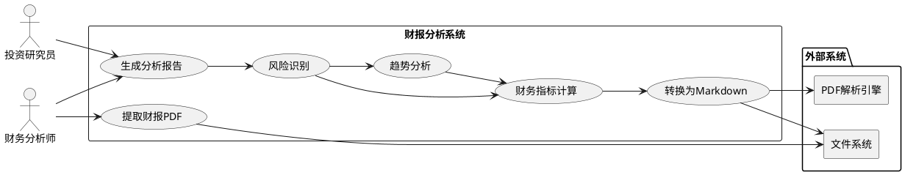
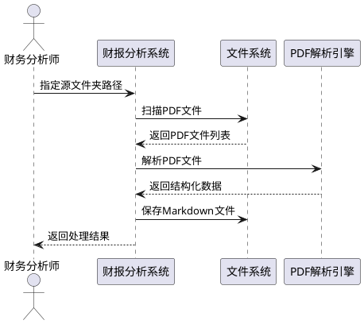
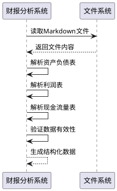
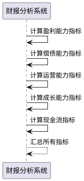
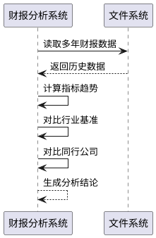
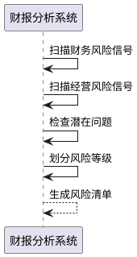
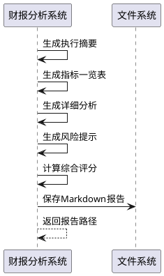

# **1. 组件定位**

## **1.1 核心职责**

本组件负责对上市公司财务报告进行自动化分析，实现识别财务风险和异常问题的核心价值。

## **1.2 核心输入**

1. **源文件夹中的财报PDF文件**：用户指定的源文件夹路径，包含待分析的上市公司年度财务报告PDF文件
2. **分析配置参数**：用户指定的分析维度、对比基准、风险阈值等配置信息
3. **行业基准数据**：用于对比分析的行业平均财务指标数据

## **1.3 核心输出**

1. **Markdown格式的分析报告**：包含财务指标计算、趋势分析、风险提示的综合分析报告
2. **问题清单**：识别出的财务异常和风险点列表
3. **可视化图表数据**：用于生成财务指标趋势图、对比图的数据

## **1.4 职责边界**

本组件不负责：
- 财报数据的采集和下载
- 实时股价和市场数据获取
- 投资建议和决策推荐
- 财报数据的审计验证

# **2. 领域术语**

**财务报告**
: 上市公司按照会计准则编制的、反映企业财务状况和经营成果的书面文件，包括资产负债表、利润表、现金流量表等。

**资产负债表**
: 反映企业在特定时点财务状况的报表，展示资产、负债和所有者权益的构成。

**利润表**
: 反映企业在一定会计期间经营成果的报表，展示收入、成本、费用和利润的形成过程。

**现金流量表**
: 反映企业在一定会计期间现金和现金等价物流入流出的报表。

**毛利率**
: （营业收入-营业成本）/营业收入×100%，反映企业产品或服务的盈利能力。

**净利率**
: 净利润/营业收入×100%，反映企业最终的盈利水平。

**ROE（净资产收益率）**
: 净利润/平均净资产×100%，反映股东权益的回报水平。

**ROA（总资产收益率）**
: 净利润/平均总资产×100%，反映企业资产的整体盈利能力。

**资产负债率**
: 负债总额/资产总额×100%，反映企业的负债水平和偿债压力。

**流动比率**
: 流动资产/流动负债，反映企业短期偿债能力。

**速动比率**
: （流动资产-存货）/流动负债，反映企业更严格的短期偿债能力。

**存货周转率**
: 营业成本/平均存货，反映存货的周转速度和管理效率。

**应收账款周转率**
: 营业收入/平均应收账款，反映应收账款的回收速度。

**自由现金流**
: 经营活动现金流-资本性支出，反映企业可自由支配的现金。

# **3. 角色与边界**

## **3.1 核心角色**

- **财务分析师**：使用本系统对上市公司财报进行深度分析，识别财务风险和投资机会
- **投资研究员**：基于财报分析结果进行投资研究和决策支持

## **3.2 外部系统**

- **PDF解析引擎**：将PDF格式的财报文件转换为结构化的Markdown文本
- **文件系统**：提供源文件夹和仓库文件夹的文件读写能力

## **3.3 交互上下文**

# **4. DFX约束**

## **4.1 性能**

- 单份财报PDF解析时间不超过30秒
- 单份财报完整分析时间不超过2分钟
- 支持批量处理，单次可处理不少于50份财报文件

## **4.2 可靠性**

- PDF解析成功率不低于95%
- 财报数据提取准确率不低于90%
- 系统可用性目标为99%

## **4.3 安全性**

- 财报文件存储必须使用加密存储
- 分析报告访问需要进行身份验证
- 关键操作需要记录审计日志

## **4.4 可维护性**

- 必须记录分析过程的详细日志
- 支持分析配置的动态调整
- 提供分析结果的版本管理

## **4.5 兼容性**

- 支持主流PDF格式的财报文件
- 分析报告输出格式兼容Markdown标准
- 支持Windows、Linux、macOS操作系统

# **5. 核心能力**

## **5.1 财报文件处理**

### **5.1.1 业务规则**

1. **文件提取规则**：系统必须从用户指定的源文件夹中自动识别并提取所有PDF格式的财报文件
   - 验收条件：[源文件夹包含PDF文件] → [系统自动识别并提取所有PDF文件]

2. **文件转换规则**：系统必须将PDF格式的财报文件转换为结构化的Markdown格式
   - 验收条件：[PDF文件有效] → [生成对应的Markdown文件并保存至仓库文件夹]

3. **文件命名规则**：转换后的Markdown文件必须保持与原PDF文件相同的文件名（扩展名除外）
   - 验收条件：[PDF文件名为"公司A_2023年报.pdf"] → [Markdown文件名为"公司A_2023年报.md"]

4. **禁止项**：系统禁止处理非PDF格式的文件
   - 验收条件：[源文件夹包含非PDF文件] → [系统跳过该文件并记录日志]

### **5.1.2 交互流程**

### **5.1.3 异常场景**

1. **源文件夹不存在**
   - 触发条件：用户指定的源文件夹路径不存在
   - 系统行为：记录错误日志，停止处理
   - 用户感知：返回错误提示"源文件夹不存在，请检查路径"

2. **PDF文件损坏**
   - 触发条件：PDF文件无法正常打开或解析
   - 系统行为：跳过该文件，记录错误日志
   - 用户感知：返回警告提示"文件[文件名]损坏，已跳过处理"

3. **仓库文件夹权限不足**
   - 触发条件：系统无写入仓库文件夹的权限
   - 系统行为：记录错误日志，停止处理
   - 用户感知：返回错误提示"仓库文件夹权限不足，无法保存文件"

## **5.2 财报数据提取**

### **5.2.1 业务规则**

1. **资产负债表提取规则**：系统必须从Markdown文件中提取资产负债表的所有关键数据项
   - 验收条件：[Markdown文件包含资产负债表] → [提取资产、负债、所有者权益等关键数据]

2. **利润表提取规则**：系统必须从Markdown文件中提取利润表的所有关键数据项
   - 验收条件：[Markdown文件包含利润表] → [提取收入、成本、费用、利润等关键数据]

3. **现金流量表提取规则**：系统必须从Markdown文件中提取现金流量表的所有关键数据项
   - 验收条件：[Markdown文件包含现金流量表] → [提取经营、投资、筹资现金流等关键数据]

4. **数据验证规则**：系统必须对提取的数据进行基本的有效性验证
   - 验收条件：[提取的数据项] → [验证数据格式、范围、逻辑关系]

### **5.2.2 交互流程**

### **5.2.3 异常场景**

1. **报表数据缺失**
   - 触发条件：Markdown文件中缺少必要的财务报表
   - 系统行为：记录警告日志，标记该财报为不完整
   - 用户感知：返回警告提示"财报缺少[报表名称]，分析结果可能不完整"

2. **数据格式异常**
   - 触发条件：提取的数据格式不符合预期（如非数字字符）
   - 系统行为：尝试数据清洗，如失败则标记为异常数据
   - 用户感知：返回警告提示"数据项[字段名]格式异常，已标记"

## **5.3 财务指标计算**

### **5.3.1 业务规则**

1. **盈利能力指标计算规则**：系统必须计算毛利率、净利率、ROE、ROA等盈利能力指标
   - 验收条件：[提取利润表和资产负债表数据] → [计算并输出盈利能力指标]

2. **偿债能力指标计算规则**：系统必须计算资产负债率、流动比率、速动比率等偿债能力指标
   - 验收条件：[提取资产负债表数据] → [计算并输出偿债能力指标]

3. **运营能力指标计算规则**：系统必须计算存货周转率、应收账款周转率、总资产周转率等运营能力指标
   - 验收条件：[提取资产负债表和利润表数据] → [计算并输出运营能力指标]

4. **成长能力指标计算规则**：系统必须计算营收增长率、净利润增长率等成长能力指标
   - 验收条件：[提取多年利润表数据] → [计算并输出成长能力指标]

5. **现金流指标计算规则**：系统必须计算自由现金流、现金储备等现金流指标
   - 验收条件：[提取现金流量表数据] → [计算并输出现金流指标]

### **5.3.2 交互流程**

### **5.3.3 异常场景**

1. **计算数据缺失**
   - 触发条件：计算某指标所需的必要数据缺失
   - 系统行为：跳过该指标计算，记录警告日志
   - 用户感知：返回警告提示"指标[指标名称]无法计算，缺少必要数据"

2. **计算结果异常**
   - 触发条件：计算结果超出合理范围（如负数、极大值）
   - 系统行为：标记该指标为异常，记录警告日志
   - 用户感知：返回警告提示"指标[指标名称]计算结果异常，请人工复核"

## **5.4 趋势与对比分析**

### **5.4.1 业务规则**

1. **多年趋势分析规则**：系统必须对同一公司多年的财务指标进行趋势分析
   - 验收条件：[存在多年财报数据] → [生成指标趋势图和趋势分析结论]

2. **行业对比分析规则**：系统必须将公司财务指标与行业平均值进行对比
   - 验收条件：[存在行业基准数据] → [生成对比分析结论]

3. **同行对比分析规则**：系统必须将公司财务指标与同行公司进行对比
   - 验收条件：[存在同行公司财报数据] → [生成同行对比分析结论]

4. **季节性分析规则**：系统应当对具有季节性特征的财务数据进行季节性分析
   - 验收条件：[存在季度财报数据] → [生成季节性分析结论]

### **5.4.2 交互流程**

### **5.4.3 异常场景**

1. **历史数据不足**
   - 触发条件：缺少足够的历史财报数据进行趋势分析
   - 系统行为：跳过趋势分析，记录信息日志
   - 用户感知：返回提示"历史数据不足，无法进行趋势分析"

2. **行业基准数据缺失**
   - 触发条件：缺少对应行业的基准数据
   - 系统行为：跳过行业对比，记录信息日志
   - 用户感知：返回提示"缺少行业基准数据，无法进行行业对比"

## **5.5 风险识别**

### **5.5.1 业务规则**

1. **财务风险识别规则**：系统必须识别财务报表中的风险信号
   - 验收条件：[财务指标异常] → [生成财务风险提示]

2. **经营风险识别规则**：系统必须识别经营层面的风险信号
   - 验收条件：[经营指标异常] → [生成经营风险提示]

3. **潜在问题预警规则**：系统必须对潜在问题进行预警
   - 验收条件：[指标接近风险阈值] → [生成预警提示]

4. **风险等级划分规则**：系统必须对识别的风险进行等级划分（高、中、低）
   - 验收条件：[识别风险] → [根据严重程度划分风险等级]

### **5.5.2 交互流程**

### **5.5.3 异常场景**

1. **风险阈值配置错误**
   - 触发条件：风险阈值配置参数格式错误或超出合理范围
   - 系统行为：使用默认阈值，记录警告日志
   - 用户感知：返回警告提示"风险阈值配置错误，已使用默认值"

## **5.6 分析报告生成**

### **5.6.1 业务规则**

1. **报告结构规则**：系统必须按照固定结构生成分析报告
   - 验收条件：[完成所有分析] → [生成包含执行摘要、指标一览表、详细分析、风险提示、综合评分的报告]

2. **执行摘要规则**：系统必须在报告开头提供核心结论的执行摘要
   - 验收条件：[生成分析报告] → [报告开头包含核心结论摘要]

3. **指标一览表规则**：系统必须提供关键财务指标的一览表
   - 验收条件：[生成分析报告] → [报告包含关键指标一览表]

4. **综合评分规则**：系统必须对财报质量进行综合评分（1-10分）
   - 验收条件：[完成所有分析] → [生成综合评分及评分依据]

5. **报告格式规则**：系统必须使用Markdown格式输出分析报告
   - 验收条件：[生成分析报告] → [报告文件为Markdown格式]

### **5.6.2 交互流程**

### **5.6.3 异常场景**

1. **报告生成失败**
   - 触发条件：报告生成过程中发生错误
   - 系统行为：记录错误日志，保存部分结果
   - 用户感知：返回错误提示"报告生成失败，已保存部分结果"

# **6. 数据约束**

## **6.1 财报文件信息**

1. **文件路径**：必须为有效的文件系统路径，支持绝对路径和相对路径
2. **文件格式**：必须为PDF格式，文件扩展名为.pdf
3. **文件大小**：单份财报PDF文件大小不超过100MB
4. **文件编码**：PDF文件内部文本编码为UTF-8或GBK

## **6.2 财务指标数据**

1. **指标数值**：必须为数值类型，支持整数和小数
2. **指标单位**：必须明确标注单位（元、万元、亿元、%等）
3. **指标精度**：保留两位小数
4. **指标范围**：必须在合理范围内（如比率类指标通常在-1000%到1000%之间）

## **6.3 分析配置参数**

1. **源文件夹路径**：必须为有效的文件夹路径
2. **仓库文件夹路径**：必须为有效的文件夹路径，且有写入权限
3. **风险阈值**：必须为数值类型，且在合理范围内
4. **分析维度**：必须为预定义的分析维度列表（盈利能力、偿债能力、运营能力、成长能力）

## **6.4 分析报告数据**

1. **报告标题**：必须包含公司名称和报告年度
2. **报告日期**：必须为报告生成的日期时间
3. **风险等级**：必须为"高"、"中"、"低"之一
4. **综合评分**：必须为1-10之间的整数
