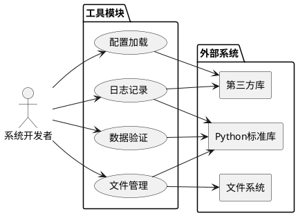

# **1. 组件定位**

## **1.1 核心职责**

本组件负责为财报分析系统提供基础工具能力，包括文件管理、配置加载、日志记录和数据验证等通用功能。

## **1.2 核心输入**

1. **文件操作请求**：文件路径、文件内容、操作类型（读/写/复制/删除）
2. **配置文件路径**：YAML格式的配置文件路径
3. **日志消息**：日志级别、日志内容、上下文信息
4. **待验证数据**：数值、日期、路径、财务数据等待验证对象

## **1.3 核心输出**

1. **文件操作结果**：文件内容、操作状态、错误信息
2. **配置对象**：结构化的配置数据对象
3. **日志输出**：控制台日志、文件日志
4. **验证结果**：验证状态、错误提示、清洗后的数据

## **1.4 职责边界**

本组件不负责：
- 业务逻辑处理
- 财报数据解析
- 指标计算
- 报告生成

# **2. 领域术语**

**文件管理器**
: 提供文件和目录操作的基础工具，包括文件读写、目录创建、文件复制、路径处理等功能。

**配置加载器**
: 负责加载和解析YAML格式的配置文件，提供配置验证和默认值合并功能。

**日志工具**
: 提供统一的日志记录功能，支持控制台输出和文件输出，支持日志轮转和彩色显示。

**数据验证器**
: 对各类数据进行有效性验证，包括数值范围、日期格式、文件路径、财务数据逻辑等验证。

**YAML**
: YAML Ain't Markup Language，一种人类可读的数据序列化格式，常用于配置文件。

**日志轮转**
: 自动管理日志文件大小和数量的机制，当日志文件达到指定大小或时间时自动创建新文件。

**类型注解**
: Python 3.5+引入的类型提示语法，用于标注变量和函数的类型信息。

# **3. 角色与边界**

## **3.1 核心角色**

- **系统开发者**：使用工具模块构建财报分析系统的核心功能
- **系统运维人员**：通过配置文件调整系统行为

## **3.2 外部系统**

- **文件系统**：提供文件和目录的底层操作能力
- **Python标准库**：提供os、pathlib、logging等基础模块
- **第三方库**：提供pyyaml、colorlog等扩展功能

## **3.3 交互上下文**

# **4. DFX约束**

## **4.1 性能**

- 文件读取操作响应时间不超过100ms（文件大小<10MB）
- 配置加载时间不超过500ms
- 日志写入操作响应时间不超过10ms
- 数据验证操作响应时间不超过50ms

## **4.2 可靠性**

- 文件操作失败必须抛出明确的异常信息
- 配置加载失败必须提供默认配置
- 日志系统必须保证不丢失日志记录
- 验证器必须捕获所有验证异常

## **4.3 安全性**

- 文件路径必须进行安全性检查，防止路径遍历攻击
- 配置文件中的敏感信息必须支持加密存储
- 日志中禁止记录敏感信息（如密码、密钥）

## **4.4 可维护性**

- 所有函数必须添加类型注解
- 所有函数必须添加文档字符串
- 代码必须符合PEP8规范
- 异常处理必须记录详细日志

## **4.5 兼容性**

- 支持Windows、Linux、macOS操作系统
- 支持Python 3.9及以上版本
- 文件路径处理必须跨平台兼容

# **5. 核心能力**

## **5.1 文件管理**

### **5.1.1 业务规则**

1. **文件读取规则**：系统必须支持读取文本文件和二进制文件
   - 验收条件：[文件存在且可读] → [返回文件内容]
   - 验收条件：[文件不存在] → [抛出FileNotFoundError异常]

2. **文件写入规则**：系统必须支持写入文本文件和二进制文件
   - 验收条件：[目标路径可写] → [成功写入文件]
   - 验收条件：[目标路径不可写] → [抛出PermissionError异常]

3. **目录创建规则**：系统必须支持递归创建目录
   - 验收条件：[目录不存在] → [创建目录及所有父目录]
   - 验收条件：[目录已存在] → [不执行任何操作]

4. **文件复制规则**：系统必须支持文件复制操作
   - 验收条件：[源文件存在] → [复制到目标路径]
   - 验收条件：[目标目录不存在] → [自动创建目标目录]

5. **路径处理规则**：系统必须提供跨平台的路径处理功能
   - 验收条件：[输入路径] → [返回规范化路径]
   - 验收条件：[相对路径] → [转换为绝对路径]

### **5.1.2 异常场景**

1. **文件不存在**
   - 触发条件：尝试读取不存在的文件
   - 系统行为：抛出FileNotFoundError异常，记录错误日志
   - 用户感知：返回错误提示"文件不存在：{文件路径}"

2. **权限不足**
   - 触发条件：尝试写入无权限的目录
   - 系统行为：抛出PermissionError异常，记录错误日志
   - 用户感知：返回错误提示"权限不足：{文件路径}"

3. **路径无效**
   - 触发条件：文件路径格式错误或包含非法字符
   - 系统行为：抛出ValueError异常，记录错误日志
   - 用户感知：返回错误提示"路径无效：{文件路径}"

## **5.2 配置加载**

### **5.2.1 业务规则**

1. **YAML加载规则**：系统必须支持加载YAML格式的配置文件
   - 验收条件：[配置文件存在且格式正确] → [返回配置字典]
   - 验收条件：[配置文件不存在] → [返回默认配置]

2. **配置验证规则**：系统必须验证配置项的有效性
   - 验收条件：[配置项有效] → [通过验证]
   - 验收条件：[配置项无效] → [抛出ConfigValidationError异常]

3. **默认配置合并规则**：系统必须支持默认配置与用户配置的合并
   - 验收条件：[用户配置缺少某项] → [使用默认配置填充]
   - 验收条件：[用户配置存在某项] → [使用用户配置值]

4. **配置访问规则**：系统必须提供便捷的配置访问接口
   - 验收条件：[使用点分隔路径] → [返回对应配置值]
   - 验收条件：[配置路径不存在] → [返回None或默认值]

### **5.2.2 异常场景**

1. **配置文件格式错误**
   - 触发条件：YAML文件格式不符合规范
   - 系统行为：抛出YAMLError异常，记录错误日志
   - 用户感知：返回错误提示"配置文件格式错误：{文件路径}"

2. **配置项缺失**
   - 触发条件：必需的配置项不存在
   - 系统行为：使用默认值或抛出异常
   - 用户感知：返回警告提示"配置项缺失，使用默认值：{配置项名称}"

3. **配置项类型错误**
   - 触发条件：配置项类型不符合预期
   - 系统行为：尝试类型转换或抛出异常
   - 用户感知：返回错误提示"配置项类型错误：{配置项名称}"

## **5.3 日志记录**

### **5.3.1 业务规则**

1. **日志初始化规则**：系统必须提供统一的日志初始化接口
   - 验收条件：[调用初始化函数] → [创建配置好的Logger对象]

2. **多输出规则**：系统必须支持同时输出到控制台和文件
   - 验收条件：[配置了多个输出] → [日志同时输出到多个目标]

3. **日志轮转规则**：系统必须支持日志文件轮转
   - 验收条件：[日志文件达到指定大小] → [创建新日志文件]
   - 验收条件：[日志文件达到指定时间] → [创建新日志文件]

4. **彩色输出规则**：系统必须支持控制台彩色输出
   - 验收条件：[控制台输出启用] → [不同级别日志显示不同颜色]

5. **日志格式规则**：系统必须支持自定义日志格式
   - 验收条件：[指定日志格式] → [按格式输出日志]

### **5.3.2 异常场景**

1. **日志目录不存在**
   - 触发条件：配置的日志目录不存在
   - 系统行为：自动创建日志目录
   - 用户感知：无感知

2. **日志文件权限不足**
   - 触发条件：无法写入日志文件
   - 系统行为：仅输出到控制台，记录警告
   - 用户感知：返回警告提示"无法写入日志文件，仅输出到控制台"

## **5.4 数据验证**

### **5.4.1 业务规则**

1. **数值验证规则**：系统必须验证数值的范围和类型
   - 验收条件：[数值在有效范围内] → [验证通过]
   - 验收条件：[数值超出范围] → [抛出ValidationError异常]

2. **日期验证规则**：系统必须验证日期格式和有效性
   - 验收条件：[日期格式正确] → [验证通过并返回日期对象]
   - 验收条件：[日期格式错误] → [抛出ValidationError异常]

3. **路径验证规则**：系统必须验证文件路径的有效性
   - 验收条件：[路径有效且存在] → [验证通过]
   - 验收条件：[路径无效] → [抛出ValidationError异常]

4. **财务数据验证规则**：系统必须验证财务数据的逻辑合理性
   - 验收条件：[资产=负债+所有者权益] → [验证通过]
   - 验收条件：[资产≠负债+所有者权益] → [抛出ValidationError异常]

5. **批量验证规则**：系统必须支持批量验证多个数据项
   - 验收条件：[传入多个数据项] → [返回所有验证结果]

### **5.4.2 异常场景**

1. **数据类型错误**
   - 触发条件：数据类型不符合预期
   - 系统行为：抛出TypeError异常，记录错误日志
   - 用户感知：返回错误提示"数据类型错误：期望{期望类型}，实际{实际类型}"

2. **数据范围错误**
   - 触发条件：数据超出有效范围
   - 系统行为：抛出ValueError异常，记录错误日志
   - 用户感知：返回错误提示"数据超出有效范围：{数据值}，有效范围：{范围}"

3. **数据格式错误**
   - 触发条件：数据格式不符合规范
   - 系统行为：抛出ValueError异常，记录错误日志
   - 用户感知：返回错误提示"数据格式错误：{数据值}"

# **6. 数据约束**

## **6.1 文件管理数据**

1. **文件路径**：必须为有效的文件系统路径，支持绝对路径和相对路径
2. **文件大小**：单次读取文件大小不超过100MB
3. **文件编码**：文本文件默认使用UTF-8编码

## **6.2 配置数据**

1. **配置文件格式**：必须为YAML格式
2. **配置文件编码**：必须使用UTF-8编码
3. **配置项类型**：必须为字符串、数值、布尔值、列表或字典类型

## **6.3 日志数据**

1. **日志级别**：必须为DEBUG、INFO、WARNING、ERROR、CRITICAL之一
2. **日志格式**：必须包含时间、级别、消息等基本信息
3. **日志文件大小**：单个日志文件大小不超过10MB
4. **日志保留数量**：保留的日志文件数量不超过10个

## **6.4 验证数据**

1. **数值范围**：必须指定最小值和最大值
2. **日期格式**：必须符合指定的日期格式字符串
3. **验证结果**：必须包含验证状态、错误信息、清洗后的数据
